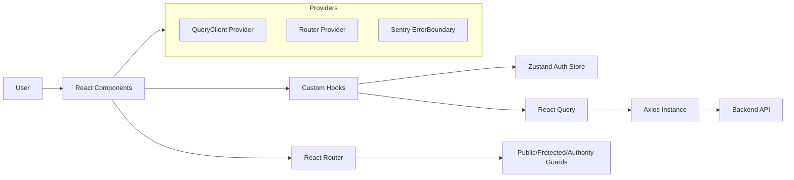

# SwiftPro Developer Onboarding Guide

Welcome to SwiftPro. This guide equips new developers to get productive quickly, covering architecture, core modules, design patterns, setup, testing, workflows, and roadmap.

## 1. System Overview

SwiftPro is a React + Vite single-page application. It uses React Router for navigation, Zustand for auth state, React Query for data fetching/caching, Axios for API communication, Tailwind for styling, and Playwright for E2E tests. Sentry is available for error boundaries.



Key technologies:
- `react`, `vite`, `react-router-dom`
- `zustand` (auth state), `@tanstack/react-query` (data)
- `axios` (HTTP), `tailwindcss` (styles), `playwright` (E2E)

## 2. Core Modules and Interactions

- `src/config/index.ts`
  - Exports `config.baseUrl` from `import.meta.env.VITE_API_BASE_URL` with a default `https://dev.swiftpro.tech/api/v1/dev`.

- `src/store/authSlice.ts`
  - Zustand store: `{ user, token, refresh, authorities }` with actions `setUser`, `setToken`, `setRefreshToken`, `setAuthorities`, `setReset`.
  - Selector hooks: `useUser`, `useToken`, `useSetUser`, `useSetToken`, etc.
  - `storeFunctions` exposed for access in non-react contexts (e.g., interceptors).

- `src/lib/axiosInstance.ts`
  - Singleton axios with `baseURL: config.baseUrl`, JSON headers, `withCredentials: false`.
  - Request interceptor: adds `Authorization: Bearer <token>` if present.
  - Response interceptor: on `401`, calls `setReset()` to clear auth state.
  - Exports helpers: `getRequest`, `postRequest`, `patchRequest`, `putRequest`, `deleteRequest`.

- `src/hooks/useAuthentication/index.tsx`
  - Returns `true` if either `user._id` or `token` exists; else `false`.

- `src/routes/index.tsx`
  - Routes grouped under `AuthLayout` (public) and `Dashboard` (protected).
  - Public: `/`, `/forgot-password`, `/reset-password`, onboarding routes, static pages.
  - Protected: dashboard feature pages (solicitation, vendor, evaluation, admin, etc.).
  - Uses `PublicRoute` to redirect authenticated users away from public pages; `ProtectedRoute` and `AuthorityGuard` to enforce auth.

- `src/components/layouts/AuthorityGuard/index.tsx`
  - Redirects unauthenticated users to `/` using `useAuthentication`.

- `src/hooks/useUserRole.ts` and `src/config/dashboardConfig.ts`
  - Role-aware dashboard config retrieval based on `user.role.name`.

- `src/providers.tsx`
  - Assembles providers: `QueryClientProvider`, `RouterProvider`, `Suspense` fallback, `Toaster`, `Sentry.ErrorBoundary`.

## 3. Design Patterns and Decisions

- Axios Singleton
  - Centralized instance with interceptors ensures consistent headers and auth handling.

- Auth State with Zustand
  - Persisted store (`persist` middleware) with selector hooks, plus `storeFunctions` for imperative use in interceptors.

- Route Guards
  - Public vs Protected routes with `useAuthentication` for simple auth checks; `AuthorityGuard` for protected layouts.

- React Query
  - Data fetching via `useQuery`/`useMutation` with `queryKey`s; `useUserQueryKey` isolates caches per user.

- Forms with Forge
  - Utilities/components under `src/lib/forge` streamline form handling and validation (yup-based).

- Path Aliases
  - `@` alias maps to `./src` via Vite/TS config for clean imports.

## 4. Development Environment Setup

Prerequisites:
- Node.js 18+ and npm (or yarn)

Install dependencies:
- `npm install`

Environment variables:
- Create `.env` (see `.env.example`):
  - `VITE_API_BASE_URL` points to your backend API.
  - `E2E_BASE_URL` optionally sets Playwright baseURL.

Run locally:
- `npm run dev` (default Vite server on `http://localhost:5173`)

Build:
- `npm run build` (TypeScript build + Vite bundle)

Lint:
- `npm run lint`

Testing (Playwright):
- Install browsers: `npx playwright install`
- Run all tests: `npm test`
- UI mode: `npm run test:ui`
- Feature-focused suites: see package scripts (e.g., `npm run test:companies`).

## 5. Code Organization and Conventions

Top-level structure:
```
src/
  components/        # UI components and layouts
  config/            # App configuration and dashboard config
  hooks/             # Custom hooks (auth, data, SEO, etc.)
  layouts/           # Page layouts (Auth, Dashboard)
  lib/               # Utilities (axios, transformers, forge)
  pages/             # Feature pages (+ localized tests)
  routes/            # Route definitions & guards
  store/             # Zustand stores
  types.ts           # Shared TypeScript types
```

Conventions:
- Components and pages: PascalCase filenames; colocate tests in `__tests__`.
- Hooks: `useXyz.ts(x)` with clear responsibilities.
- Expose reusable HTTP via `src/lib/axiosInstance.ts` helpers.
- Prefer `@/` imports; avoid deep relative paths.

## 6. Testing Strategy and QA

Approach:
- Feature-local Playwright suites in `src/pages/**/__tests__/`.
- Categories: basic, API, detailed, performance.
- Base configuration in `playwright.config.ts` with `E2E_BASE_URL` support.

Useful scripts:
- `npm run test:headed`, `npm run test:ui`, `npm run test:report`.

Reference:
- See `docs/TESTING.md` for full guidance, structure, and examples.

## 7. Common Troubleshooting

- 401 Unauthorized loops
  - Interceptor calls `setReset()` → user logged out. Ensure token is valid and `VITE_API_BASE_URL` points to correct environment.

- CORS or network errors
  - Verify backend CORS settings and `baseUrl`. Check `withCredentials` requirements; currently `false`.

- Env variables not applied
  - Vite uses `import.meta.env.*`. Ensure `.env` exists and restart dev server.

- Playwright cannot connect
  - Confirm dev server at `http://localhost:5173`; set `E2E_BASE_URL` if using a custom port.

- Strict TypeScript errors
  - Project uses `strict: true`. Fix types or refine `types.ts` definitions.

- Styling glitches after Tailwind upgrade
  - Confirm Tailwind v4 setup and plugin usage. Re-run dev server after config changes.

## 8. Recommended Development Workflows

- Add a new API-backed feature
  1) Create page under `src/pages/FeaturePage/` with `index.tsx`.
  2) Add route in `src/routes/index.tsx` under the appropriate layout/guard.
  3) Fetch data with React Query; wrap calls using `getRequest`/`postRequest` from `axiosInstance`.
  4) Add forms using Forge components; validate with `yupResolver`.
  5) Add feature-local Playwright tests in `__tests__/`.

- Auth-aware components
  - Use `useAuthentication` for basic gating and `AuthorityGuard` when rendering protected layouts.

- Role-aware behavior
  - Use `useUserRole` and `dashboardConfig` for role-based views/actions.

## 9. Important Business Logic

- Authentication & session
  - Login sets `token` and `user` via `useSetToken`/`useSetUser`.
  - Interceptors attach bearer token; `401` triggers logout.

- Onboarding flows
  - `OnboardingPage` and `VendorOnboardingPage` consume `:encodedData` route param; after successful registration, they set `user`/`token` and navigate into the dashboard.

- Password reset
  - `ResetPasswordPage` reads `token` from query params, validates with yup, and calls `/auth/reset-password`.

- Role-based dashboard and navigation
  - `useUserRole` maps `user.role.name` to `dashboardConfig` to drive available actions and navigation.

## 10. Future Roadmap and Technical Debt

- Token refresh
  - Implement refresh token flow in axios interceptors to avoid forced logout on `401`.

- Centralized error handling
  - Expand interceptor and React Query error boundaries; integrate Sentry DSN for reporting.

- API types and validators
  - Consolidate and refine `src/types.ts` and forge validators for consistency.

- Config management
  - Add environment-specific configs and secrets handling; formalize `.env.e2e`, `.env.dev`, `.env.prod`.

- Authorization depth
  - Extend `AuthorityGuard` to consider `authorities` beyond boolean auth.

- Performance & maintainability
  - Decompose very large pages (e.g., Solicitation Management) into smaller modules.

- Test coverage expansion
  - Add suites for remaining feature pages and critical flows.

---

For questions or improvements, open an issue or PR with your proposal. Happy building!